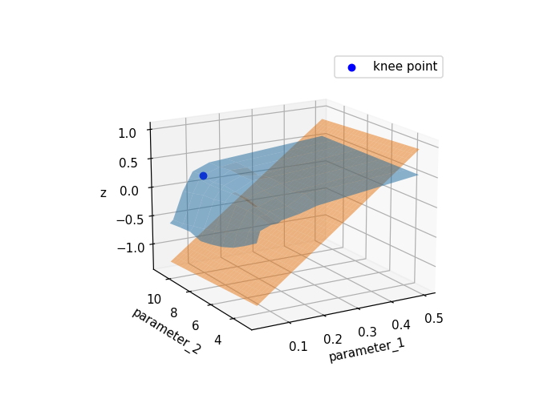

# HyperKnee Finder

This tool will found the optimal values for two inter-dependant parameters using the well known knee/elbow method.

The method prescribe to search for the point where the curvature is at the maximum ([Here an example](https://en.wikipedia.org/wiki/Elbow_method_(clustering))).

A more formal definition (from Satopää, Albrecht, Irwin, and Raghavan, 2011, p.1) states that the knee/elbow point is the point after which:

> relative costs to increase [or decrease, NdC] some tunable parameter is no longer worth the corresponding performance benefit

While usually this method is used for tuning one single parameter, nothing impeach to the same for  multiple, 
inter-dependant parameters. This tool is anyway able to find the optimal value only for two parameters.

In facts, HyperKnee Finder is a 2-d generalisation of the [KneeFinder](https://github.com/vlavorini/kneefinder) tool.

## Motivations for HyperKnee Finder
In many situations the parameters of an algorithm depends on each other.  What you usually do is to ignore this 
dependency, and so you optimise the first parameter, then you use the found value to optimise the second parameter. 

Acting like this, in general, does not guarantee you to land on the optimal combination for the two parameters.

Indeed, you have to evaluate all the possible combination of the two parameters, and at that point
you can make your choice.
